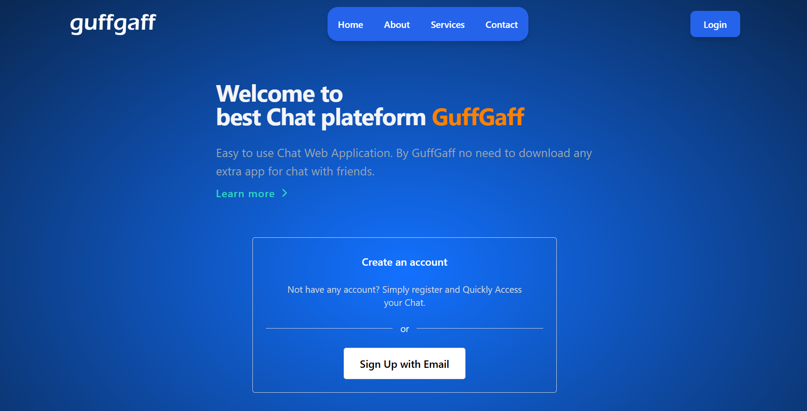
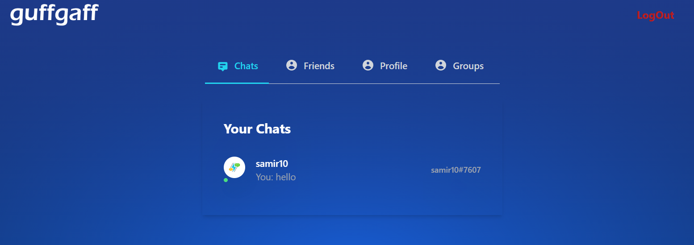
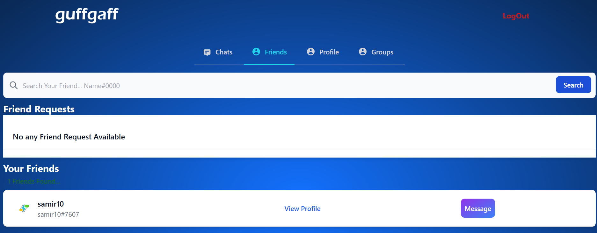
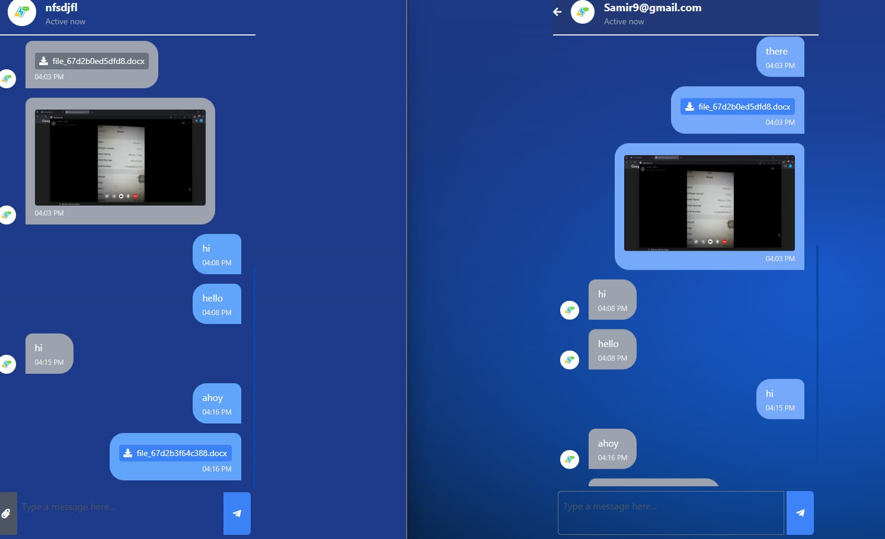

<h1 align="center">Web Chatting System(GuffGaff)</h1>

  
GuffGaff is a real-time private chat application. It allows users to chat privately, view user status, 
    and exchange files using AJAX-based real-time interaction and a responsive design, though the code is not very clean.
 
 
<h2>Features</h2>
<ul>
    <li>Real-time private one to one chat using Ajax</li>
    <li>Files sharing(images,docs etc)</li>
    <li>User Status(active/unactive) detection</li>
    <li>Password Hashing using MD5(though it is not secure ;)</li>
     <li>Responsive design</li>
</ul>
 
<h2>Tech Stack</h2>
<ul>
    <li>PHP for background logik</li>
    <li>MySQL for storing users and messages</li>
    <li>JavaScript and AJAX for real-time messaging</li>
    <li>Html/Tailwind Css for responsive UI</li>
</ul>
 
<h2>Preview</h2>
<table align="center">
  <tr><td></td></tr>
  <tr><td align="center">Home Page</td></tr>
</table>
<table align="center">
  <tr><td></td></tr>
  <tr><td align="center">Sign up Page</td></tr>
</table>
<table align="center">
  <tr><td></td></tr>
  <tr><td align="center">Message Section</td></tr>
</table>
<table align="center">
  <tr><td></td></tr>
  <tr><td align="center">Friends Section</td></tr>
</table>
<table align="center">
  <tr><td></td></tr>
  <tr><td align="center">Private Chat</td></tr>
</table>

